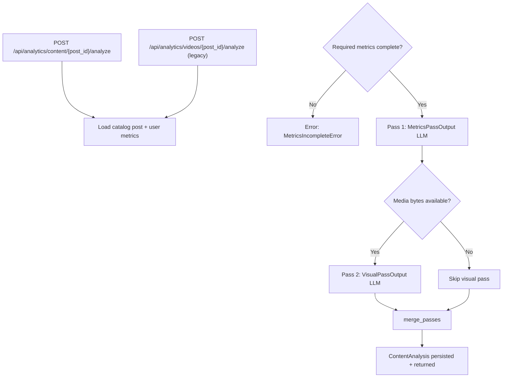

# Content Analytics: VIDEO + IMAGE Analysis — Input & Output Reference

This document describes the unified `ContentAnalysis` domain model produced when you click
**Analyze** on a post in **Analytics → Content**. Both **VIDEO** and **IMAGE** TikTok posts
use the same two-pass pipeline with type-specific content sections and visual prompts.

---

## High-level flow



**Entry point:** `AnalyticsService.analyze_content()` → `ContentAnalystAgent`

**API identifier:** `{post_id}` is the analytics catalog post ID (serialized as `video_id` in
JSON for backward compatibility). An optional CMS `content_id` (UUID) can be passed in the
request body for plan linking.

**Analysis modes** (in `metadata.analysis_mode`):

| Mode | When |
|------|------|
| `metrics_only` | No media file resolved |
| `full` | Upload or TikTok download succeeded |

**Key source files:**

| Area | Path |
|------|------|
| Domain model | `backend/app/models/content_analysis.py` |
| Content types | `backend/app/models/content_types.py` |
| Input builder | `backend/app/agents/content_analyst/input_builder.py` |
| Orchestration | `backend/app/services/analytics_service.py` |
| Media resolution | `backend/app/services/media_resolver.py` |
| Visual analysis | `backend/app/services/content_visual_analysis.py` |
| Performance injection | `backend/app/services/performance_analysis_builder.py` |
| Merge | `backend/app/services/analysis_merge.py` |
| Agent | `backend/app/agents/content_analyst/agent.py` |
| Metrics prompt | `backend/prompts/content_analyst/metrics/` |
| Visual prompts | `backend/prompts/content_analyst/visual/video/` and `.../image/` |

---

## Content type resolution

`build_content_analysis_input()` resolves `ContentType` in this order:

1. Explicit `content_type` on catalog item or request body override
2. Upload MIME (`image/*` → IMAGE, `video/*` → VIDEO)
3. TikTok provider `PostInfo.content_type` when available
4. CMS `contents.media_type` when `linked_content_id` provided
5. Default `VIDEO`

---

## Top-level output: `ContentAnalysis`

The API returns a single unified object. Pass provenance is tracked in `metadata`.

```text
ContentAnalysis
├── executive_summary
├── content_analysis          # VideoContentAnalysisSection | ImageContentAnalysisSection
├── audience_analysis
├── performance_analysis
├── performance_diagnosis
├── recommendations
└── metadata
```

### Type-specific `content_analysis`

| Type | Model | Key fields |
|------|-------|------------|
| VIDEO | `VideoContentAnalysisSection` | `hook`, `story_script`, `voiceover`, `scenes[]`, `pacing` |
| IMAGE | `ImageContentAnalysisSection` | `composition`, `typography`, `visual_hierarchy`, `branding`, `message_clarity`, `call_to_action`, `visual_appeal`, `color_harmony`, `scroll_stopping_potential` |

### Shared primitives

| Type | Purpose |
|------|---------|
| `Evidence` | `source` + `description` — every conclusion links to observable facts |
| `RatedDimension` | `rating` (excellent→poor) + `score` (1–10) + `confidence` + explanation |
| `SceneAnalysis` | Timestamp-bounded scene with effectiveness rating (VIDEO) |
| `RootCause` | Ranked performance driver with `estimated_impact` and evidence |
| `Recommendation` | Actionable item with required `evidence[]` |

---

## Pass 1: Metrics analysis

**Agent method:** `ContentAnalystAgent._run_metrics_pass()`  
**Prompt:** `content_analyst/metrics`  
**LLM:** Text provider (`LLM_PROVIDER`)  
**Validates to:** `MetricsPassOutput` (internal)

### Input variables

| Variable | Content |
|----------|---------|
| `{{content_type}}` | `VIDEO` or `IMAGE` |
| `{{video_data}}` | `PostInfo` JSON |
| `{{performance_data}}` | `PerformanceMetrics` JSON |
| `{{comments}}` | Sample comment strings |
| `{{historical_context}}` | Recent CMS posts |

**Metrics readiness:** VIDEO requires engagement + optional watch metrics; IMAGE requires
engagement only (views, likes, comments, shares, saves).

---

## Pass 2: Visual analysis (conditional)

**Agent method:** `ContentAnalystAgent.analyze_visual_content()`  
**Prompts:** `content_analyst/visual/video` or `content_analyst/visual/image`  
**Service:** `ContentVisualAnalysisService` (Gemini / OpenAI / mock)  
**Validates to:** `VisualPassOutput` (internal)

Runs when `resolve_media_source()` returns bytes (upload priority, then TikTok download).

| Provider | VIDEO strategy | IMAGE strategy |
|----------|---------------|----------------|
| Mock | `build_visual_pass_response()` | `build_image_visual_pass_response()` |
| Gemini | Temp file + video upload poll | Direct image bytes |
| OpenAI | ffmpeg frame sampling | Single image vision call |

---

## Merge layer

`merge_passes(content_type, ...)` produces the final `ContentAnalysis`:

| Section | VIDEO | IMAGE |
|---------|-------|-------|
| `content_analysis` | Visual overrides hook/pacing/story/voiceover | Visual fills image dimensions |
| `audience_analysis` | Retention timestamps from metrics | Engagement/comment focus |
| `executive_summary` | Synthesized from root causes + dimensions | Same logic, image dimension labels |
| `performance_diagnosis` | Merged, deduped root causes | Same |
| `recommendations` | Grouped immediate / experiments / future | Same |

---

## API

### Primary endpoint

`POST /api/analytics/content/{post_id}/analyze?force=false`

```json
{
  "content_id": "optional-cms-uuid",
  "content_type": "VIDEO"
}
```

### Legacy delegate

`POST /api/analytics/videos/{post_id}/analyze?force=false` — identical behavior.

### Response

```json
{
  "success": true,
  "data": { "...ContentAnalysis..." },
  "analysis_id": "uuid",
  "version": 1
}
```

Stored in `content_analyses.payload` as JSON. The DB column `video_id` remains unchanged
(opaque post ID).

---

## Dashboard projection: `ContentAnalysisSummary`

Each `ContentCatalogItem.analysis` includes:

| Field | VIDEO | IMAGE |
|-------|-------|-------|
| `content_type` | `VIDEO` | `IMAGE` |
| `content_ratings` | Hook, pacing, story, voiceover | Composition, CTA, branding, etc. |
| `scenes` | Scene timeline | Empty |
| `analysis_mode` | `full` / `metrics_only` | Same |

---

## Environment variables

| Variable | Purpose |
|----------|---------|
| `LLM_PROVIDER` | Text LLM for Pass 1 |
| `VISUAL_ANALYSIS_PROVIDER` | Visual provider: `auto`, `mock`, `gemini`, `openai` |
| `VISUAL_ANALYSIS_MODEL` | Model for Pass 2 |
| `GEMINI_API_KEY` | Required for Gemini visual analysis |

---

## Extension guide

To add a new content type (e.g. carousel):

1. Add `ContentType.CAROUSEL` enum value
2. Add `CarouselContentAnalysisSection` + visual prompt dir `content_analyst/visual/carousel/`
3. Add provider branch in `ContentVisualAnalysisService`
4. Add one `merge_passes` branch for carousel section merge

The pipeline (`ContentAnalysisInput` → metrics pass → visual pass → merge) stays fixed.

---

## Re-analyze note

Analyses are versioned. Click **Re-analyze** (`force=true`) to regenerate with the current
domain model after schema or prompt changes.
