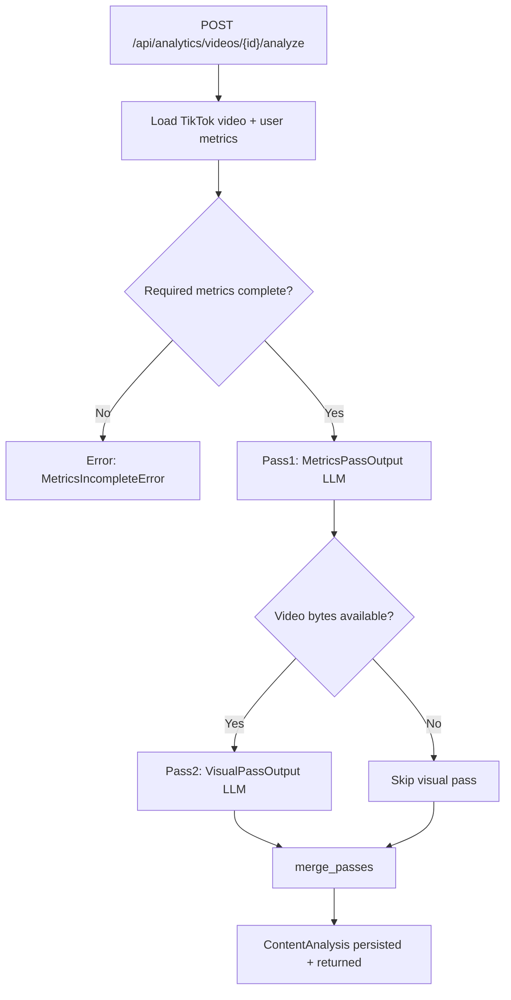

# Content Analytics: Video Analysis — Input & Output Reference

This document describes the unified `ContentAnalysis` domain model produced when you click
**Analyze** on a video in **Analytics → Content**.

---

## High-level flow



**Entry point:** `AnalyticsService.analyze_video()` → `ContentAnalystAgent`

**Analysis modes** (in `metadata.analysis_mode`):

| Mode | When |
|------|------|
| `metrics_only` | No video file resolved |
| `full` | Upload or TikTok download succeeded |

**Key source files:**

| Area | Path |
|------|------|
| Domain model | `backend/app/models/content_analysis.py` |
| Orchestration | `backend/app/services/analytics_service.py` |
| Performance injection | `backend/app/services/performance_analysis_builder.py` |
| Merge | `backend/app/services/analysis_merge.py` |
| Agent | `backend/app/agents/content_analyst/agent.py` |
| Metrics prompt | `backend/prompts/content_analyst_video/` |
| Visual prompt | `backend/prompts/content_analyst_video_visual/` |

---

## Top-level output: `ContentAnalysis`

The API returns a single unified object. Pass provenance is **not** exposed in the body
(only in `metadata` for operational tracking).

```text
ContentAnalysis
├── executive_summary
├── content_analysis
├── audience_analysis
├── performance_analysis
├── performance_diagnosis
├── recommendations
└── metadata
```

### Shared primitives

Defined in `backend/app/models/content_analysis.py` for reuse by future agents:

| Type | Purpose |
|------|---------|
| `Evidence` | `source` + `description` — every conclusion links to observable facts |
| `RatedDimension` | `rating` (excellent→poor) + `score` (1–10) + `confidence` + explanation |
| `SceneAnalysis` | Timestamp-bounded scene with effectiveness rating |
| `RootCause` | Ranked performance driver with `estimated_impact` and evidence |
| `Recommendation` | Actionable item with required `evidence[]` |

---

## Pass 1: Metrics analysis

**Agent method:** `ContentAnalystAgent._analyze_video_data()`  
**Prompt:** `content_analyst_video`  
**LLM:** Text provider (`LLM_PROVIDER`)  
**Validates to:** `MetricsPassOutput` (internal — not returned directly)

### Input

| Variable | Content |
|----------|---------|
| `{{video_data}}` | `VideoInfo` JSON |
| `{{performance_data}}` | `PerformanceMetrics` JSON (user metrics overlaid) |
| `{{comments}}` | Sample comment strings |
| `{{historical_context}}` | Recent CMS posts |

### Pass 1 output sections

| Section | Produced by Pass 1 |
|---------|-------------------|
| `audience_analysis` | Primary |
| `content_analysis_partial` | Partial (retention-inferred, low confidence) |
| `performance_diagnosis.root_causes` | From metrics + comments |
| `recommendations` | Metrics-backed with evidence |

---

## Pass 2: Visual analysis (conditional)

**Agent method:** `ContentAnalystAgent.analyze_video_visual()`  
**Prompt:** `content_analyst_video_visual`  
**Service:** `VideoAnalysisService` (Gemini / OpenAI / mock)  
**Validates to:** `VisualPassOutput` (internal)

Runs only when `resolve_video_source()` returns bytes (upload priority, then TikTok download).

### Input

| Attachment | Content |
|------------|---------|
| Prompt text | System + user prompt with duration, plan context, performance summary |
| `plan_json` | Video metadata subset |
| Video | Full file (Gemini) or sampled frames (OpenAI) |

### Pass 2 output sections

| Section | Produced by Pass 2 |
|---------|-------------------|
| `content_analysis` | Primary (hook, story_script, voiceover, scenes, pacing) |
| `performance_diagnosis.root_causes` | Supplemental scene/script evidence |
| `recommendations` | Visual-backed with scene evidence |

---

## Service-injected: `performance_analysis`

Built by `build_performance_analysis()` from TikTok data + user metrics **before** merge.
The LLM does not echo raw metrics — this section describes **WHAT** happened.

```json
{
  "video": { "...VideoInfo..." },
  "metrics": { "...PerformanceMetrics..." },
  "engagement": { "...EngagementMetrics..." },
  "performance_summary": "Neutral factual paragraph"
}
```

---

## Merge layer

`merge_passes()` in `analysis_merge.py` produces the final `ContentAnalysis`:

| Section | Merge behavior |
|---------|----------------|
| `executive_summary` | Synthesized from top root cause + best/worst dimensions + first action |
| `content_analysis` | Visual overrides hook/pacing/story/voiceover when present |
| `audience_analysis` | Metrics primary; visual augments drop-off timestamps |
| `performance_analysis` | Passed through from service (unchanged) |
| `performance_diagnosis` | Root causes merged, deduped, ranked by impact |
| `recommendations` | Grouped: immediate / experiments / future_content |
| `metadata` | Version, providers, models, prompt versions, `generated_at` |

No `visual_review` nested object in the final output.

---

## API response

**Endpoint:** `POST /api/analytics/videos/{video_id}/analyze?force=false`

```json
{
  "success": true,
  "data": { "...ContentAnalysis..." },
  "analysis_id": "uuid",
  "version": 1
}
```

Stored in `content_analyses.payload` as JSON.

---

## Dashboard projection: `VideoAnalysisSummary`

The Content page receives a slim projection on each `VideoCatalogItem.analysis`:

| Field | Source |
|-------|--------|
| `executive_summary` | Full executive summary |
| `content_ratings` | Hook, pacing, story, voiceover ratings |
| `scenes` | Scene timeline |
| `top_root_causes` | Top 3 root causes |
| `immediate_improvements` | High-impact actions |
| `experiments` | Test suggestions |
| `future_content_ideas` | Follow-up content |
| `performance_summary` | Factual performance paragraph |
| `analysis_mode` | `full` / `metrics_only` |

---

## Environment variables

| Variable | Purpose |
|----------|---------|
| `LLM_PROVIDER` | Text LLM for Pass 1 |
| `VIDEO_ANALYSIS_PROVIDER` | Visual provider: `auto`, `mock`, `gemini`, `openai` |
| `VIDEO_ANALYSIS_MODEL` | Model for Pass 2 |
| `GEMINI_API_KEY` | Required for Gemini visual analysis |

---

## Re-analyze note

Analyses are versioned. Existing analyses from the old flat schema are incompatible —
click **Re-analyze** (`force=true`) to regenerate with the new domain model.
